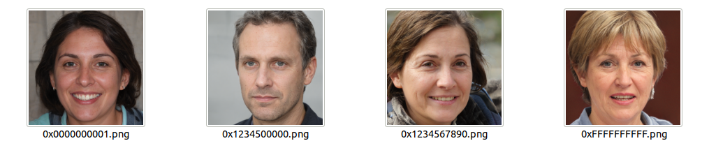

## StyleGAN2 &mdash; Blockchain Implementation


**Making StyleGAN2 ready for the chain**<br>
Wrapper of StyleGAN2 to accept hash seed input.

## Requirements

* Both Linux and Windows are supported. Linux is recommended for performance and compatibility reasons.
* 64-bit Python 3.6 installation. We recommend Anaconda3 with numpy 1.14.3 or newer.
* We recommend TensorFlow 1.14, which we used for all experiments in the paper, but TensorFlow 1.15 is also supported on Linux. TensorFlow 2.x is not supported.
* On Windows you need to use TensorFlow 1.14, as the standard 1.15 installation does not include necessary C++ headers.
* One or more high-end NVIDIA GPUs, NVIDIA drivers, CUDA 10.0 toolkit and cuDNN 7.5. To reproduce the results reported in the paper, you need an NVIDIA GPU with at least 16 GB of DRAM.
* Docker users: use the [provided Dockerfile](./Dockerfile) to build an image with the required library dependencies.

StyleGAN2 relies on custom TensorFlow ops that are compiled on the fly using [NVCC](https://docs.nvidia.com/cuda/cuda-compiler-driver-nvcc/index.html). To test that your NVCC installation is working correctly, run:

```.bash
nvcc test_nvcc.cu -o test_nvcc -run
| CPU says hello.
| GPU says hello.
```

On Windows, the compilation requires Microsoft Visual Studio to be in `PATH`. We recommend installing [Visual Studio Community Edition](https://visualstudio.microsoft.com/vs/) and adding into `PATH` using `"C:\Program Files (x86)\Microsoft Visual Studio\2019\Community\VC\Auxiliary\Build\vcvars64.bat"`.

## Generating images with pre-trained networks

Pre-trained networks are stored as `*.pkl` files on the [StyleGAN2 Google Drive folder](https://drive.google.com/open?id=1QHc-yF5C3DChRwSdZKcx1w6K8JvSxQi7). Below, you can either reference them directly using the syntax `gdrive:networks/<filename>.pkl`, or download them manually and reference by filename.

In this case stylegan2-ffhq-config-f.pkl in the same folder is used by default

```.bash
# Generate ffhq images from default address seeds
python3 run_generator.py generate-images

# Generate ffhq images from address hex seeds, increased truncation
python3 run_generator.py generate-images --network=stylegan2-ffhq-config-f.pkl --seeds=0x1234,12345 --truncation-psi=1 

```

The results are placed in `results/<RUNNING_ID>/*.png`. You can change the location with `--result-dir`. For example, `--result-dir=~/my-stylegan2-results`.

You can import the networks in your own Python code using `pickle.load()`. For this to work, you need to include the `dnnlib` source directory in `PYTHONPATH` and create a default TensorFlow session by calling `dnnlib.tflib.init_tf()`. See [run_generator.py](./run_generator.py) and [pretrained_networks.py](./pretrained_networks.py) for examples.

## Input
- All inputs are interpreted as hex numbers: 0x01 == 01
- The seeding algorithm works by splitting a long hex string in 8-char arrays and converting them into uint32. These uint are then passed on to np.random.RandomState()
- Leading zeros are stripped for the seed and are kept for the image filename.

## Output


This is the output of:
```.bash
python3 run_generator.py generate-images

```

The default seeds used are '0x0000000001,0x1234567890,0x1234500000,0xFFFFFFFFFF'


## License
This work is forked from https://github.com/NVlabs/stylegan2


The original work is made available under the Nvidia Source Code License-NC. To view a copy of this license, visit https://nvlabs.github.io/stylegan2/license.html

